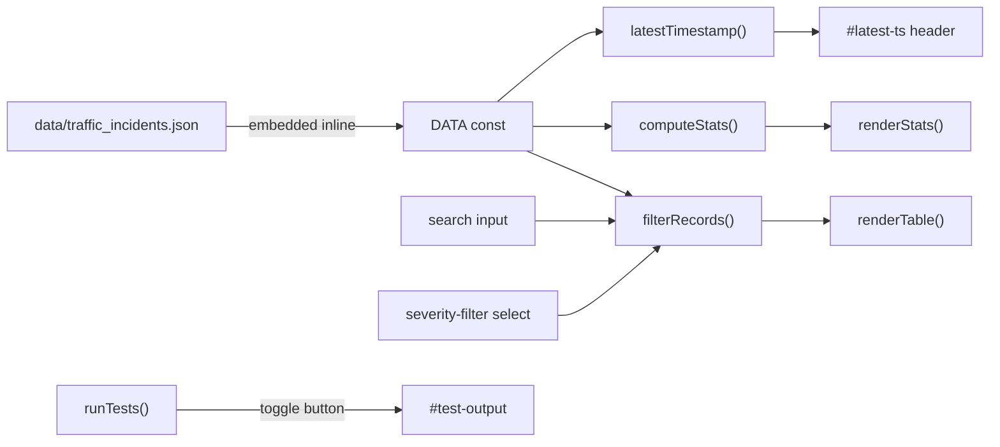

# TD-3 — Recent traffic incident dashboard (`index3.html`)

**Ticket:** [TD-3](https://ltads.atlassian.net/browse/TD-3) · **PR:** [#2](https://github.com/leonyap27/TrafficPulse-Demo/pull/2) · **Bucket:** Other

## What changed

A new standalone HTML dashboard, `index3.html`, was added at the repo root. It is a zero-dependency, single-file dashboard that surfaces recent traffic incidents from the dummy dataset (`data/traffic_incidents.json`) for operations users.

The implementation mirrors the established pattern from `index1.html` (TD-1) — chosen as the conservative, project-consistent reading because the ticket did not specify a different design.

## Architecture at a glance

## File layout

| Section in `index3.html` | Lines (approx.) | Purpose |
|---|---|---|
| HTML comment header | 1–20 | Dataset schema + run + test instructions (AC 10) |
| `<style>` | 25–170 | Card grid, table, controls, empty state, test panel |
| `<header>` / `<main>` | 158–205 | Stat cards container, search/filter controls, table, empty state, test toggle |
| `DATA` const | 210–217 | Inline mirror of `data/traffic_incidents.json` (5 records) |
| Helpers | 219–245 | `formatTs`, `latestTimestamp`, `computeStats`, `filterRecords` |
| Renderers | 247–286 | `renderStats`, `renderTable`, `render`, `renderTimestamp` |
| `runTests()` | 304–375 | 17 built-in assertions covering all ACs |

## AC → implementation mapping

| AC | Where |
|---|---|
| 1. Total incidents | `computeStats().total` → "Total Incidents" card |
| 2. High severity | `computeStats().high` → "High Severity" card |
| 3. By type | `computeStats().byType` → 4 type cards (Accidents, Congestion, Roadworks, Breakdowns) |
| 4. Incident table | `renderTable()` |
| 5. Severity filter | `<select id="severity-filter">` → `filterRecords()` |
| 6. Road / location search | `<input id="search">` → `filterRecords()` (case-insensitive) |
| 7. Latest timestamp | `latestTimestamp()` → `#latest-ts` in header |
| 8. Empty state | `#empty-state` div + `computeStats([])` tests |
| 9. Test coverage | `runTests()` with 17 assertions + toggle button |
| 10. Documentation | HTML comment header at top of file |

## Test approach

In-browser `runTests()` covers:

- Stats over full dataset (total=5, high=2, per-type counts)
- Stats over empty dataset (total=0, high=0)
- `latestTimestamp` for populated and empty arrays
- Severity filter (High / Low / All)
- Road-name search (PIE → INC-001)
- Location-keyword search ("woodlands" → INC-004)
- Case-insensitivity
- No-match returns empty array (drives empty state)
- Combined filter (ECP + High → INC-005)
- Combined filter no match (ECP + Low → 0)

There is no headless runner — browser verification is the gate. The DFSL run that produced this change recorded that as a **human-verify** item; the human review on PR #2 confirmed it.

## Risk / rollback

Net-new file. Rollback = `git rm index3.html`. No existing code path touched.

## Provenance

Implemented autonomously via `/dfsl TD-3` (Do First Sorry Later). Per-phase confidence at PR time: Plan High · Impl High · Test Medium. See the DFSL disclaimer in PR #2 for the assumptions list and items that needed human verification before merge.
